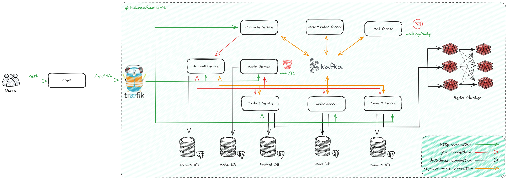

# SAGA ORCHESTRATION

Microservice architecture with Saga Orchestration pattern

## Technical stack:
- Traefik:  edge proxy that is responsible for external traffic routing and internal grpc load-balancing.
- Services: 8 services are implemented in this project.
  - Account service: responsible for managing user accounts, tokens.
  - Product service: responsible for managing products, categories.
  - Order service: responsible for managing orders.
  - Payment service: responsible for managing payments.
  - Purchase service: responsible for managing purchases.
  - Orchestrator service: responsible for managing the saga orchestration.
  - Media service: responsible for managing media files.
  - Mail service: responsible for sending emails.
- Database: 5 databases are used in this project.
  - Account database (PostgreSQL 15): responsible for storing user accounts, tokens.
  - Product database (PostgreSQL 15): responsible for storing products, categories.
  - Order database (PostgreSQL 15): responsible for storing orders.
  - Payment database (PostgreSQL 15): responsible for storing payments.
  - Media database (PostgreSQL 15): responsible for storing media files.
- Six-node Redis cluster
  - In-memory data store for caching.
  - Cuckoo filter for preventing cache penetration.
  - Distributed lock for preventing cache stampede.
- Kafka:  distributed event streaming platform.
  - Used for SAGA command and event.
- MinIO:  high-performance object storage.
  - Used for storing media files.
- MailHog:  email testing tool.
  - Used for testing email sending.

## Architecture diagram


## Quick start

Clone this repository:
```sh
git clone https://github.com/
cd saga-orchestration
```
#### Docker usage

Run this command:
```sh
docker compose up
```

#### Simple usage
First, we need to signup a new user:
```bash
curl --location 'http://localhost/api/v1/account/register' \
--header 'Content-Type: application/json' \
--data-raw '{
    "email": "deptrai@gmail.com",
    "password": "deptrai123",
    "first_name": "dep",
    "last_name": "trai",
    "address": "123 quan 9",
    "phone_number": "0110213813"
}'
```
This will return a new token pair (refresh token + access token). We should provide the access token in the `Authorization` header for those APIs with authentication. If your access token is expired. You can login again or get new access token via refresh token.
Then, we will get to [mailhog](http://localhost:8025) to get the verification code. The verification code is sent to the email you provided when registering.
```bash
curl --location 'http://localhost/api/v1/account/login' \
--header 'Content-Type: application/json' \
--data-raw '{
    "email": "deptrai@gmail.com",
    "password": "deptrai123"
}'
```

Then, we can get personal information:
```bash
curl --location 'http://localhost/api/v1/account/customer/personal' \
--header 'Content-Type: application/json' \
--header 'Authorization: Bearer <access_token>' \
--data-raw ''
```

Next, let's create a category to contains some product:
```bash
curl --location 'http://localhost/api/v1/categories' \
--header 'Content-Type: application/json' \
--header 'Authorization: Bearer <access_token>' \
--data '{
    "name" : "Phone",
    "description": "Smartphone"
}'
```

Go to database and get ID of category recently created to create some products
Replace `<category_id>` with the ID of the category you just created.
Replace `<id_account>` with the ID of the account you just created.

```bash
curl --location 'http://localhost/api/v1/products' \
--header 'Content-Type: application/json' \
--header 'Authorization: Bearer <access_token>' \
--data '{
    "category_id": "7a1da0e6-d720-46f5-8e50-99ee702e094d",
    "id_account": "624f57da-c501-4834-bda1-9e5389c5c24a",
    "name": "Iphone 13",
    "description": "Iphone 13",
    "brand_name": "Apple",
    "price": 125,
    "inventory": 1000
}'
```
```bash
curl --location 'http://localhost/api/v1/products' \
--header 'Content-Type: application/json' \
--header 'Authorization: Bearer <access_token>' \
--data '{
    "category_id": "7a1da0e6-d720-46f5-8e50-99ee702e094d",
    "id_account": "624f57da-c501-4834-bda1-9e5389c5c24a",
    "name": "Iphone 14 Pro",
    "description": "Iphone 14 Pro",
    "brand_name": "Apple",
    "price": 150,
    "inventory": 1000
}'
```
After creating products, we will recieve the product ID. We will use this ID to create a new purchase.

Here comes the core part. We are going to create a new purchase, which sends a new purchase event to the saga orchestrator and triggers distributed transactions.
```bash
curl --location 'http://localhost/api/v1/purchases' \
--header 'Content-Type: application/json' \
--header 'Authorization: Bearer <access_token>' \
--data '{
    "order_items": [
        {
            "product_id": <first_product_id>,
            "quantity": 4
        },
        {
            "product_id": <second_product_id>,
            "quantity": 5
        }
    ],
    "payment": {
        "currency_code": "VND"
    }
}'
```
Upload file image, videos of product
Support type file: png, jpg, jpeg, mp4
```bash
curl --location --request POST 'http://localhost/api/v1/media/upload' \
--header 'Authorization: Bearer <access_token>' \
--header 'Content-Type: application/json' \
-F "product_id=YOUR_PRODUCT_ID" \
-F "alt=YOUR_ALTERNATIVE_TEXT" \
-F "data=@PATH_TO_IMAGE_FILE1" \
-F "data=@PATH_TO_IMAGE_FILE2" \
-F "data=@PATH_TO_IMAGE_FILE3" \
```

### Benchmark
```bash
./1kpurchases.sh
```
Result: processing 1000 purchases in 1 minute
With configuration:
  - service: 64 poolsize kafka consumer
  - orchestrator: 100 poolsize kafka consumer
  - kafka: 10 partitions
Use: base + 1.5GB memory
You can change the configuration in `docker-compose.yml` file to get better performance.

## Services
### Account service
No. | API | Method | Authorization required | Description
--- | --- | --- | --- | ---
1 | [/api/v1/account/register](http://localhost/api/v1/account/register) | POST | false | Register account
2 | [/api/v1/account/login](http://localhost/api/v1/account/login) | POST | false | Login account
3 | [/api/v1/account/customer/personal](http://localhost/api/v1/account/customer/personal) | GET | true | Get personal information

### Product service
No. | API | Method | Authorization required | Description
--- | --- | --- | --- | ---
1 | [/api/v1/products/:id](http://localhost/api/v1/products/:id) | GET | false | Get a product with id
2 | [/api/v1/products](http://localhost/api/v1/products) | POST | true | Create a product
3 | [/api/v1/products/:id](http://localhost/api/v1/products) | PUT | true | Update product detail
4 | [/api/v1/categories](http://localhost/api/v1/categories) | POST | true | Create a category

### Order service
No. | API | Method | Authorization required | Description
--- | --- | --- | --- | ---
1 | [/api/v1/orders/:id](http://localhost/api/v1/orders/:id) | GET | true | Get an order with id

### Payment service
No. | API | Method | Authorization required | Description
--- | --- | --- | --- | ---
1 | [/api/v1/payments/:id](http://localhost/api/v1/payments/:id) | GET | true | Get a payment with id

### Purchase service
No. | API | Method | Authorization required | Description
--- | --- | --- | --- | ---
1 | [/api/v1/purchases](http://localhost/api/v1/purchases) | POST | true | Make  a purchase
### Media Service
No. | API | Method | Authorization required | Description
--- | --- | --- | --- | ---
1 | [/api/v1/media/upload](http://localhost/api/v1/media/upload) | POST | true | Upload media file
2 | [http://localhost:9000/images/:id](http://localhost:9000/images/:id) | GET | false | Use CDN to get media file or iframe to display image
3 | [http://localhost:9000/videos/:id](http://localhost:9000/videos/:id) | GET | false | Use CDN to get media file or iframe to display video
## Monitor

### Kafkdrop
[http://localhost:9000](http://localhost:9000)

### Traefik
[http://localhost:8080](http://localhost:8080)

### MinIO
[http://localhost:9001](http://localhost:9001)

### MailHog
[http://localhost:8025](http://localhost:8025)

## TODO
- [ ] API for categories
- [ ] Implement more grpc api for services
- [ ] Try to use kafka cluster
- [ ] Implement more API for services
- [ ] Implement full payment service
- [ ] Fix pgx use too much connections to database issue (over default 100 connections)